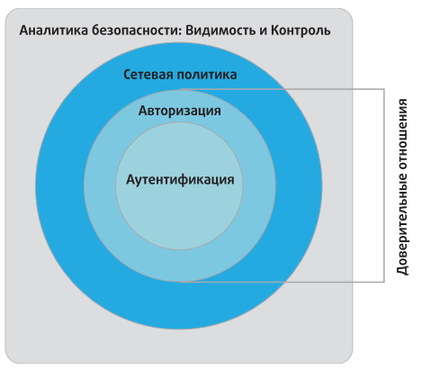

>   **МИНИСТЕРСТВО НАУКИ И ВЫСШЕГО ОБРАЗОВАНИЯ РОССИЙСКОЙ ФЕДЕРАЦИИ**

ФЕДЕРАЛЬНОЕ ГОСУДАРСТВЕННОЕ БЮДЖЕТНОЕ ОБРАЗОВАТЕЛЬНОЕ

УЧРЕЖДЕНИЕ ВЫСШЕГО ОБРАЗОВАНИЯ

«МОСКОВСКИЙ АВИАЦИОННЫЙ ИНСТИТУТ

(национальный исследовательский университет)»

**Факультет (институт, филиал)**  **№4**  **Кафедра 406**

**Направление подготовки**  **Радиотехника**  **Группа М4В-302Б**

**Квалификация (степень)**   **\_____Бакалавриат_\_**

**РЕФЕРАТ**

На тему: Архитектура Интернет вещей –IoT .

Реферат сдал_Арсютин Артем Владимирович______\_ \_____(____________)

(фамилия, имя, отчество)

Реферат принял Терехин Алексей Геннадиевич__________\_ (____________)

(фамилия, имя, отчество)

Москва 2020

**ОГЛАВЛЕНИЕ**

[Введение	3](#_Toc59097281)

[1 Сетевая архитектура интернета вещей	4](#_Toc59097282)

[2 Архитектура безопасности	11](#_Toc59097283)

[Заключение	16](#_Toc59097284)

[Список использованных источников	18](#_Toc59097285)

ВВЕДЕНИЕ

Интернет вещей (Internet of Things, IoT) – новейший этап длительной и еще не
закончившейся революции в области вычислительных систем и средств связи. Его
размер, многообразие и влияние на повседневную жизнь, коммерческую деятельность
и государственное управление затмевают предыдущую историю технического
прогресса. IoT — это термин, которым обозначается все разрастающийся комплекс
подключенных друг к другу интеллектуальных устройств, от бытовой техники до
крошечных датчиков. Доминантной темой является встраивание мобильных
приемопередатчиков малого радиуса действия в разнообразные гаджеты и предметы
повседневного быта, что открывает новые формы коммуникации между людьми и
вещами, а также между разными вещами. Сегодня Интернет обеспечивает соединение
между собой миллиардов промышленных и бытовых предметов, как правило, с помощью
облачных систем. Такие предметы передают информацию датчиков, действуют в
соответствии со своим окружением, а иногда могут самомодифицироваться, создавая
общую среду управления более крупной системой, такой как завод или даже город.

Таким образом, целью данной работы выступает исследование особенностей
архитектуры Интернет-вещей.

В соответствии с поставленной целью в работе предстоит решить задачи:

\- описать сетевую архитектуру Интернета вещей;

\- охарактеризовать архитектуру безопасности Интернета вещей;

\- сделать выводы по работе в целом.

>   1 СЕТЕВАЯ АРХИТЕКТУРА ИНТЕРНЕТА ВЕЩЕЙ

Архитектура IoT может предоставить следующие преимущества:

\- дать администратору сети или IT-менеджеру полезный контрольный список для
оценки функциональности и полноты предложений от разных поставщиков;

\- служить ориентиром для разработчиков в плане того, какие функции нужны в IoT
и как они взаимодействуют;

\- служить основой для стандартизации, стимулируя совместимость и сокращение
расходов[^1].

[^1]: Саруханова О. «Интернет вещей» — это уже не выдумка из научной фантастики
    // Аргументы и факты. - 2016. - № 21.

Приведем обзор архитектуры IoT, разрабатываемой сектором стандартизации
Международного союза электросвязи (МСЭ-Т или ITU-T).

В отличие от большинства других эталонных моделей и архитектурных моделей,
описанных в литературе, модель МСЭ-Т детализирует фактические физические
компоненты экосистемы IoT. Это полезно, так как высвечивает элементы экосистемы
IoT, которые должны быть соединены, интегрированы, управляемы и предоставлены
приложениям. Детальная спецификация экосистемы описывает требования к
возможностям IoT.

Один из важных аспектов, который заостряет модель, — тот факт, что IoT на деле
не является сетью физических вещей. Это скорее сеть устройств, взаимодействующих
с физическими вещами, вместе с прикладными платформами — такими как компьютеры,
планшеты и смартфоны, — которые взаимодействуют с этими устройствами.

Уникальным аспектом IoT, по сравнению с другими сетевыми системами, очевидно
является наличие множества физических вещей и устройств, отличных от
вычислительных устройств и устройств обработки данных. На рис. 1.1,
адаптированном из Рекомендации Y.2060, изображены типы устройств в модели МСЭ-Т.
Модель рассматривает IoT как сеть устройств, тесно связанных с вещами. Сенсорные
и исполнительные устройства взаимодействуют с физическими вещами в окружающей
среде. Устройства сбора данных считывают данные из физических вещей или
записывают данные на физические вещи путем взаимодействия с устройствами
переноса данных или носителями данных, подключенными или связанными с физическим
объектом тем или иным образом.

Рис. 1.1 - Типы устройств и их взаимосвязь с физическими вещами

Эта модель проводит различие между устройствами переноса данных и носителями
данных. Устройство всегда обладает возможностями связи и может обладать другими
электронными возможностями. Примером устройства переноса данных является
RFID-бирка. В то же время носитель данных — это элемент, присоединенный к
физической вещи с целью идентификации или информирования.

Технологии, используемые для взаимодействия между устройствами сбора данных и
устройствами переноса данных или носителями данных, включают радиочастотное,
инфракрасное, оптическое и гальваническое возбуждение.

На рис. 1.2 приведен обзор элементов, задействованных в IoT. В левой части
рисунка приведены различные способы связи с физическими устройствами.
Предполагается, что одна или несколько сетей поддерживают связь между
устройствами.

Рис. 1.2 - Технический обзор IoT

На рис. 1.2 появляется еще одно устройство, связанное с IoT: шлюз. Как минимум
шлюз работает транслятором между протоколами. Шлюзы решают одну из главных
проблем при проектировании IoT, а именно проблему совместимости, как между
разными устройствами, так и между устройствами и Интернетом либо корпоративной
сетью. «Умные» устройства поддерживают широкий спектр беспроводных и проводных
технологий передачи данных и сетевых протоколов. Кроме того, возможности
обработки данных у таких устройств, как правило, ограничены.

Шлюз поддерживает различные технологии доступа к устройствам, позволяя
устройствам обмениваться данными друг с другом и с сетью — Интернетом или
корпоративной сетью, содержащей приложения IoT. Такие схемы доступа могут,
например, включать ZigBee, Bluetooth и Wi-Fi.

Шлюз поддерживает необходимые сетевые технологии как для локальных, так и для
глобальных сетей. Эти технологии могут включать в себя Ethernet и Wi-Fi на
территории организации, а также сотовую связь, Ethernet, DSL и кабельный доступ
к Интернету и глобальным корпоративным сетям.

Шлюз поддерживает взаимодействие с приложениями, управление сетью и функции
безопасности.

Рассмотрим возможности связи устройств между собой. Первая возможность — связь
между устройствами через шлюз. Например, с помощью шлюза сенсорное или
исполнительное устройство с поддержкой Bluetooth может осуществлять связь с
устройством сбора данных или устройством общего назначения, использующим Wi-Fi.
Вторая возможность — связь по сети связи без шлюза. Например, если все
устройства в сети «умного дома» поддерживают Bluetooth, они могут управляться с
компьютера, планшета или смартфона с поддержкой Bluetooth. Третья возможность —
прямая связь устройств между собой по отдельной локальной сети, в то время как
связь с внешней сетью (на рисунке не показана) осуществляется через шлюз LAN.

Каждая физическая вещь в интернете вещей может быть представлена в
информационном мире одной или несколькими виртуальными вещами, но при этом
виртуальная вещь может существовать без соответствующей физической вещи.
Физические вещи сопоставлены виртуальным вещам, хранящимся в БД и других
структурах данных. Приложения обрабатывают виртуальные вещи и работают с
ними[^2].

[^2]: Богданова И.Ф., Богданова Н.Ф. Интернет вещей в научных исследованиях //
    Социология науки и технологий. – 2017.

На рис. 1.3 изображена эталонная модель IoT от МСЭ-Т, состоящая из четырех
уровней плюс возможности управления и безопасности, действующие между уровнями.

Рис. 1.3 - Эталонная модель IoT

Уровень сети выполняет две базовых функции. Возможности сети относятся к
взаимодействию устройств и шлюзов. Транспортные возможности относятся к
транспорту информации служб и приложений IoT, а также информации управления и
контроля IoT. Грубо говоря, эти возможности соответствуют сетевому и
транспортному уровням OSI.

Уровень поддержки услуг и поддержки приложений предоставляет возможности,
которые используются приложениями. Многие разнообразные приложения могут
использовать общие возможности поддержки. К примерам относятся общая обработка
данных и управление БД. Специализированные возможности поддержки — это
конкретные возможности, которые предназначены для удовлетворения потребностей
конкретного подмножества приложений IoT.

Уровень приложения состоит из всех приложений, взаимодействующих с
IoT-устройствами.

Уровень возможностей управления охватывает традиционные функции управления
сетью, т.е. управление неисправностями, управление конфигурацией, управление
учетом, управление показателями работы и управление безопасностью.

В качестве примеров общих возможностей управления:

\- управление устройствами: примеры включают обнаружение устройств,
аутентификацию, дистанционную активацию и деактивацию устройств, конфигурацию,
диагностику, обновление прошивки и/или ПО, управление рабочим статусом
устройства;

\- управление топологией локальной сети: примером является управление
конфигурацией сети;

\- управление трафиком и перегрузками: например, обнаружение условий
перегруженности сети и реализация резервирования ресурсов для срочных и/или
жизненно важных потоков трафика.

Специализированные возможности управления тесно связаны с требованиями
приложений, например, требованиями по контролю линии передачи электроэнергии в
«умной» электросети.

Уровень возможностей обеспечения безопасности включает общие возможности
обеспечения безопасности, которые не зависят от приложений:

\- на уровне приложения: авторизацию, аутентификацию, защиту конфиденциальности
и целостности данных приложения, защиту неприкосновенности частной жизни, аудит
безопасности и антивирусную защиту;

\- на уровне сети: авторизацию, аутентификацию, конфиденциальность данных об
использовании и данных сигнализации, а также защиту целостности данных
сигнализации;

\- на уровне устройства: аутентификацию, авторизацию, проверку целостности
устройства, управление доступом, защиту конфиденциальности и целостности данных.

Специализированные возможности обеспечения безопасности тесно связаны с
требованиями приложений, например, требованиями безопасности мобильных
платежей[^3].

[^3]: Трембач В.М. Модульная архитектура интеллектуальной системы для решения
    задач интернета вещей // Открытое образование. – 2019. - №3(4). – С. 32.

# **2 АРХИТЕКТУРА БЕЗОПАСНОСТИ**

Компания Cisco Systems, сыгравшая ведущую роль в разработке модели Всемирного
форума IoT, разработала фреймворк безопасности IoT, ставший полезным дополнением
к эталонной модели Всемирного форума IoT. На рисунке 2.1 показана среда
безопасности, связанная с логической структурой IoT.

Рис. 2.1 - Среда безопасности IoT

Модель Cisco IoT представляет собой упрощенную версию модели Всемирного форума
IoT. Она состоит из следующих уровней:

«Умные» объекты/встроенные системы: этот уровень включает в себя
сенсорные/исполнительные устройства и другие встроенные системы на границе сети.
Эта часть IoT наиболее уязвима. Устройства могут находиться в среде, не
защищенной физически, и от них может требоваться функционирование в течение
нескольких лет. Доступность тоже является важной проблемой. Кроме того,
менеджерам сети необходимо заботиться об аутентичности и целостности данных,
генерируемых сенсорами, и о защите исполнительных устройств и других «умных»
устройств от несанкционированного использования. Также могут присутствовать
такие требования, как конфиденциальность и защита от подслушивания.

Туманная/периферийная сеть: этот уровень представляет проводные и беспроводные
соединения устройств IoT. Кроме того, на этом уровне может осуществляться
определенный объем обработки и консолидации данных. Ключевой проблемой является
большая вариативность сетевых технологий и протоколов, используемых различными
устройствами IoT, и необходимость выработки и воплощения единой политики
безопасности.

Ядро сети: уровень ядра сети предоставляет пути для передачи данных между
платформами в центре сети и устройствами IoT. Здесь проблемы безопасности те же,
что в традиционных сетях. Однако огромное количество оконечных узлов, с которыми
надо взаимодействовать и управлять ими, создает значительную проблему для
безопасности.

Центр данных/облако: этот уровень содержит платформы для приложений, хранения
данных и управления сетью. IoT не привносит на этот уровень никаких новых
проблем безопасности, кроме необходимости иметь дело с гигантским количеством
отдельных оконечных узлов.

С помощью этой четырехуровневой архитектуры модель Cisco определяет четыре общих
возможности безопасности, охватывающих несколько уровней:

Безопасность на основе ролей: системы управления доступом на основе ролей
(Role-Based Access Control, RBAC) назначают права доступа ролям, а не отдельным
пользователям. Пользователям, в свою очередь, сопоставляются различные роли,
либо статически, либо динамически, соответственно обязанностям. RBAC широко
используется в коммерческих облачных и корпоративных системах. Этот инструмент,
понятный администраторам, может использоваться для управления доступом к
IoT-устройствам и генерируемым ими данным[^4].

[^4]: Баркова Н.Ю., Жерега Д.Д., Попова Е.А., Логачёва В.П. Применение Интернета
    вещей в цепях поставок фармацевтической индустрии // Вестник университета. –
    2019. - № (9). – С. 68.

Защита от вмешательства и обнаружение вмешательств: эта функция особенно важна
на уровне устройств и туманной сети, но распространяется также и на уровень ядра
сети. Все эти уровни могут использовать компоненты, физически находящиеся вне
физически охраняемой территории предприятия.

Защита данных и конфиденциальность: эти функции охватывают все уровни
архитектуры.

Защита протоколов Интернета: защита «данных в движении» от подслушивания и
перехвата важна для всех уровней.

На рисунке 2.1 отмечены конкретные функциональные области безопасности поверх
четырех уровней модели IoT. Также предлагается концепция безопасности IoT,
определяющая компоненты функции безопасности для IoT, охватывающей все уровни,
как показано на рис. 2.2.

Рис. 2.2 - Безопасный фреймворк IoT

Перечислим компоненты.

Аутентификация: этот компонент охватывает элементы, инициирующие доступ, и
первым делом идентифицирует устройства IoT. В отличие от типичных корпоративных
сетевых устройств, для которых идентификация может осуществляться по
идентификационным признакам человека (таким как имя/пароль или бейдж), оконечные
устройства IoT должны оснащаться такими методами аутентификации, которые не
требуют вмешательства человека. К таким методам относятся радиочастотные метки,
сертификаты x.509 или MAC-адреса оконечных устройств.

Авторизация: авторизация управляет доступом к устройству через структуру сети.
Этот элемент включает в себя контроль доступа. Вместе с уровнем аутентификации
он вырабатывает необходимые параметры для того, чтобы разрешить обмен
информацией между устройствами и между устройствами и прикладными платформами,
тем самым обеспечивая работу IoT-служб.

Сетевая политика: этот компонент охватывает все элементы, осуществляющие
маршрутизацию и транспортировку трафика с оконечных устройств по инфраструктуре,
будь то контроль, управление или собственно трафик данных.

Аналитика безопасности, включая видимость и контроль: этот компонент включает
все функции, необходимые для централизованного управления устройствами IoT. В
первую очередь он охватывает видимость IoT устройств, означающую попросту то,
что центральные функции управления безопасно оповещены о парке распределенных
устройств IoT, включая идентичность и атрибуты каждого устройства. На основе
такой видимости возникает способность осуществлять контроль, включая
конфигурацию, патчи и обновления, а также контрмеры для пресечения угроз.

Важным элементом этой концепции являются доверительные отношения. В этом
контексте доверительные отношения означают способность двух партнеров по обмену
быть уверенными в идентичности и правах доступа друг друга. Аутентификационный
компонент концепции доверия реализует базовый уровень доверия, дополняемый
авторизационным компонентом.

Можно привести пример того, что автомобиль может установить доверительные
отношения с другой машиной того же изготовителя. Такие доверительные отношения,
однако, могут позволить машинам обмениваться только сведениями о безопасности.
При установлении доверительных отношений между той же самой машиной и дилерской
сетью машина может передавать и получать дополнительную информацию, такую как
показания одометра и результаты последнего техобслуживания[^5].

[^5]: Ким Е.О., Шин А.А. Интернет вещей: перспективы применения // [Вестник
    Челябинского государственного
    университета](https://cyberleninka.ru/journal/n/vestnik-chelyabinskogo-gosudarstvennogo-universiteta).
    – 2019.

# **ЗАКЛЮЧЕНИЕ**

Таким образом, в заключении следует сделать выводы по рассмотренной теме.

IoT состоит из набора различных инфокоммуникационных технологий, которые
обеспечивают его работу. Архитектура Интернета вещей показывает, как разные
технологии связаны между собой.

Он состоит из «умных» объектов, соединенных с сенсорами. Они обеспечивают сбор и
обработку информации в реальном времени для соответствующих целей. Например, для
измерения температуры, давления, скорости движения, местоположения и многого
другого. Развитие микропроцессоров привело к сокращению физических размеров
аппаратных сенсоров и позволило внедрять их повсеместно.

Обычно, вещи имеют соединение со шлюзами, подключаемыми к локальной или
глобальной вычислительной сети. Но есть и самодостаточные устройства, которые
могут работать на базе сетей сотовых операторов (подключение с помощью Wi-Fi или
Ethernet). Сами шлюзы являются концентраторами, поддерживающими определенный
стандарт или протокол, обеспечивающий связь с «Вещами».

Для реализации широкого спектра задач в IoT необходимо обеспечить совместную
работу множества различных технологий и протоколов. Сети доступа должны
обеспечивать требуемые значения передачи информации по задержке, пропускной
способности и безопасности. Уровень шлюзов предназначен для соединения
разнородных сетей в единую сетевую платформу.

Сетевые шлюзы позволяют пользователям или автоматизированным системам,
обеспечить сетевое взаимодействие с конечными устройствами IoT-инфраструктуры,
посредством поддерживаемого стандарта связи.

Сервисный уровень содержит набор информационных услуг, обеспечивающих
автоматизацию технологических и бизнес-операций в IoT:

-   поддержка операционной и бизнес-деятельностей;

-   различная аналитическая обработка информации;

-   интерфейс хранения, ввода/вывода данных из внешней системы;

-   приложение (API);

-   обеспечение информационной безопасности;

-   управление различными бизнес-процессами;

-   централизованная панель управления «Вещами».

На этом уровне архитектуры IoT существуют различные типы приложений для
соответствующих промышленных секторов и сфер.

# **СПИСОК ИСПОЛЬЗОВАННЫХ ИСТОЧНИКОВ**

1.  Баркова Н.Ю., Жерега Д.Д., Попова Е.А., Логачёва В.П. Применение Интернета
    вещей в цепях поставок фармацевтической индустрии // Вестник университета. –
    2019. - № (9). – С. 68-74.

2.  Богданова И.Ф., Богданова Н.Ф. Интернет вещей в научных исследованиях //
    Социология науки и технологий. – 2017.

3.  Ким Е.О., Шин А.А. Интернет вещей: перспективы применения // [Вестник
    Челябинского государственного
    университета](https://cyberleninka.ru/journal/n/vestnik-chelyabinskogo-gosudarstvennogo-universiteta).
    – 2019.

4.  Саруханова О. «Интернет вещей» — это уже не выдумка из научной фантастики //
    Аргументы и факты. - 2016. - № 21.

5.  Трембач В.М. Модульная архитектура интеллектуальной системы для решения
    задач интернета вещей // Открытое образование. – 2019. - №3(4). – С. 32-43.
